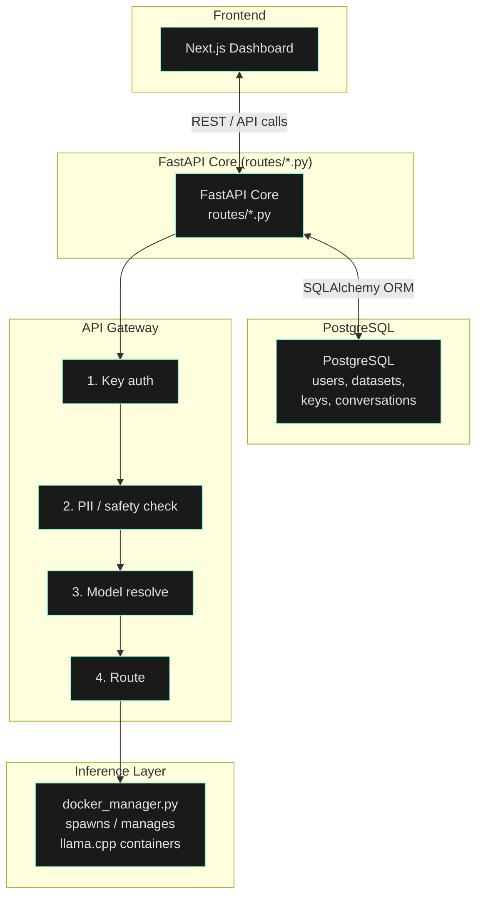

# Forge

Forge is a self-hosted AI platform for running small language models behind a clean, OpenAI-compatible API. It bundles inference, retrieval-augmented generation (RAG), dataset curation, LoRA fine-tuning, and an API gateway with key management — all controlled from a single dashboard.

Built for teams and individuals who want full control over their model infrastructure: no third-party API calls, no data leaving your machine, and no vendor lock-in.

## Why Forge

- **Own your stack** — Models run locally via `llama.cpp`; nothing is sent to an external inference provider.
- **Drop-in compatible** — The gateway speaks the OpenAI API dialect, so existing SDKs, libraries, and tools work unmodified.
- **End-to-end, not just inference** — Document ingestion, dataset curation, fine-tuning, and serving are all part of the same platform instead of stitched-together tools.
- **Built-in governance** — Every gateway request is screened for PII before it reaches a model, and every key's usage is logged.

## Features

- **Local inference** — Spin up and route requests to `llama.cpp` models running in Docker containers, no cloud dependency required.
- **OpenAI-compatible API gateway** — `/v1/chat/completions` and `/v1/models` endpoints that work with existing OpenAI SDKs and tooling.
- **API key management** — Issue, revoke, and track usage of scoped API keys for external consumers, with per-key token usage logs.
- **PII / safety checking** — Requests are screened before being routed to a model.
- **RAG pipeline** — Upload documents, chunk and embed them, and tune retrieval at query time (top-k, similarity threshold, context budget).
- **Flexible dataset ingestion** — Bring your own data in almost any common format; Forge normalizes it into a clean training set automatically.
- **LoRA fine-tuning** — Train lightweight adapters on top of base models, with pause/resume/stop control and live log streaming.
- **Chat playground** — Streaming chat UI with adjustable inference parameters for quick experimentation.
- **Auth & settings** — User registration/login, account settings, and password management.

## Architecture



Background workers handle the heavier, longer-running jobs outside the request/response cycle:

| Worker | Responsibility |
|---|---|
| `rag_worker.py` | Document chunking, embedding generation, and vector storage for retrieval |
| `dataset_processor.py` | Parses raw uploads, cleans and deduplicates rows, and quarantines anything malformed or low-quality |
| `training_worker.py` | Runs LoRA fine-tuning jobs, merges adapters, converts to GGUF, and streams logs live |
| `docker_manager.py` | Starts, stops, and health-checks `llama.cpp` inference containers on demand |

On shutdown, Forge automatically stops every `llama.cpp` container it spawned during the session, so no orphaned containers are left running.

## Tech Stack

**Backend**
- FastAPI with async SQLAlchemy ORM
- PostgreSQL
- Docker (container lifecycle management for `llama.cpp` inference servers)
- JWT-based authentication
- PEFT / LoRA for fine-tuning, with GGUF conversion for serving

**Frontend**
- Next.js (TypeScript)
- shadcn/ui + Tailwind CSS
- Geist font

## API Gateway

Forge exposes an OpenAI-compatible endpoint so it can be used as a drop-in replacement for the OpenAI API in existing tools:

```bash
curl http://localhost:8000/v1/chat/completions \
  -H "Authorization: Bearer YOUR_API_KEY" \
  -H "Content-Type: application/json" \
  -d '{
    "model": "your-model-name",
    "messages": [{"role": "user", "content": "Hello!"}]
  }'
```

Every request to the gateway passes through a four-stage pipeline:

1. **API key validation** — confirms the key is active and scoped correctly.
2. **PII / safety check** — screens the request payload before it reaches a model.
3. **Model resolution** — maps the requested model name to a running (or startable) `llama.cpp` container.
4. **Inference routing** — forwards the request to the resolved container and streams the response back.

API keys can be created, viewed, and revoked from the **Endpoints** page in the dashboard, which also shows token usage and ready-to-copy code snippets for external integrations.

### Using the official OpenAI SDK

Because the gateway matches the OpenAI API shape, you can point the official client libraries at Forge with no code changes beyond the base URL:

```python
from openai import OpenAI

client = OpenAI(
    api_key="YOUR_FORGE_API_KEY",
    base_url="http://localhost:8000/v1",
)

response = client.chat.completions.create(
    model="your-model-name",
    messages=[{"role": "user", "content": "Hello!"}],
)
print(response.choices[0].message.content)
```

## RAG Pipeline

Documents uploaded through a conversation are chunked, embedded, and stored for retrieval. Retrieval behavior is tunable per request:

- **Top-k** — number of chunks retrieved
- **Similarity threshold** — minimum relevance score for a chunk to be included
- **Context budget** — token ceiling for retrieved context, to leave room for the model's response

## Dataset Ingestion

Forge accepts training data in nearly any format your existing data already lives in — there's no need to pre-convert everything into a single rigid schema before uploading:

- **CSV / Excel** — tabular data with instruction/response-style columns
- **JSON / JSONL** — structured records, including pre-formatted instruction-response pairs
- **PDF / DOCX** — long-form documents, which are automatically chunked into training-sized passages
- **Plain text** — raw `.txt` files, also auto-chunked

Once uploaded, every file goes through the same normalization pipeline regardless of its original format:

1. **Schema detection** — Forge inspects the parsed rows and infers the underlying data shape (raw QA pairs vs. unstructured passages that need chunking).
2. **Cleaning & deduplication** — rows are canonicalized, near-duplicate entries are collapsed, and PII is scrubbed from free text.
3. **Quality filtering** — low-entropy, boilerplate, or junk text (e.g. unformatted policy blobs) is flagged rather than silently included.
4. **Quarantine review** — anything that fails cleaning isn't discarded; it's set aside in a quarantine queue you can review, fix, and restore from the dashboard.
5. **Pair formatting** — surviving rows are converted into instruction/response pairs, with long passages auto-chunked using a configurable chunk size and overlap.
6. **Export** — the final, cleaned dataset is written out as JSONL, ready to feed directly into a fine-tuning job.

You can also edit individual training pairs by hand after processing, reprocess a dataset with different chunking settings, or restore quarantined rows you've fixed — all without re-uploading the source file.

## Fine-Tuning

Forge fine-tunes models using **LoRA** (Low-Rank Adaptation), which trains a small set of adapter weights on top of a frozen base model instead of updating every parameter. This keeps fine-tuning fast and memory-efficient enough to run on local hardware.

A typical fine-tuning job:

1. Pick a base model and a processed dataset.
2. Configure training parameters — epochs, learning rate, batch size, warmup steps, and max sequence length.
3. Forge automatically selects appropriate LoRA target modules for the chosen architecture and applies the adapter (rank 8, alpha 16, dropout 0.05 by default).
4. Training runs as a background job with live, streamed logs — progress and per-epoch checkpoints are visible in real time from the dashboard.
5. Jobs can be **paused, resumed, or stopped** at any point without losing progress.
6. On completion, the LoRA adapter is merged into the base model weights and converted to **GGUF**, so the fine-tuned model is immediately servable through `llama.cpp` — no separate export or conversion step required.

This means the full loop — raw data in, fine-tuned model out, serving through the same OpenAI-compatible gateway — happens entirely within Forge.

## Security Notes

- Passwords are capped at 72 characters and hashed with bcrypt.
- API gateway traffic is screened for PII prior to inference, and the same scrubbing is applied to uploaded training data before it's used for fine-tuning.
- Forge is designed for self-hosted, trusted-network use; it does not ship with rate limiting or WAF-level protections out of the box, so plan accordingly if exposing it publicly.

## Contributing

Issues and pull requests are welcome. Before submitting a PR:

- Keep backend changes consistent with the existing async SQLAlchemy patterns.
- Run any new endpoints through the existing four-stage gateway pipeline rather than bypassing it.
- Match the existing shadcn/ui + Tailwind conventions on the frontend.

## License

Add your license here.